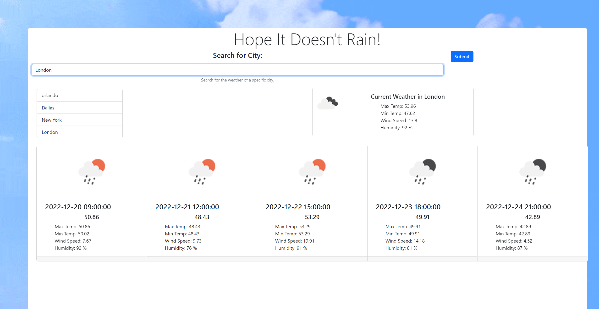
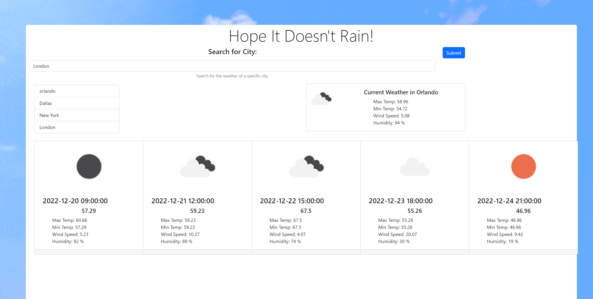

# 06 Server-Side APIs: Weather Dashboard
## User Story

```
AS A traveler
I WANT to see the weather outlook for multiple cities
SO THAT I can plan a trip accordingly
```

## Acceptance Criteria

```
GIVEN a weather dashboard with form inputs
WHEN I search for a city
THEN I am presented with current and future conditions for that city and that city is added to the search history
WHEN I view current weather conditions for that city
THEN I am presented with the city name, the date, an icon representation of weather conditions, the temperature, the humidity, and the wind speed
WHEN I view future weather conditions for that city
THEN I am presented with a 5-day forecast that displays the date, an icon representation of weather conditions, the temperature, the wind speed, and the humidity
WHEN I click on a city in the search history
THEN I am again presented with current and future conditions for that city
```

## Mock-Up

The following image shows the web application's appearance and functionality:


## Screenshots of Application

The following images demonstrate what the appearance and the functionality resemble in it's current iteration:





## Deployed Webpage
[Deployed Website Link](https://geckogiggles.github.io/hopeitdoesntrain/)


https://geckogiggles.github.io/hopeitdoesntrain/

## Development in Progress
Some changes were made to the mock up design layout to be more dynamic by using a moving background. The search history was not made with buttons as implied by the mockup, but rather made as an event listener on the element "li". Many stylistic choices were planned differently for ease of use and aesthetics. Some changes that will be made in the following iteration include display flaw touch-ups (div sizes), more readability within the cards, and greater interest-creating elements on the page.